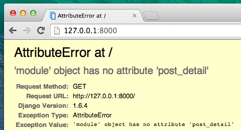
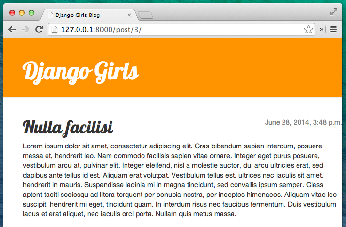

# Estendi la tua applicazione

Abbiamo completato i passi necessari per la creazione del nostro sito: sappiamo come scrivere un modello, una url, una view ed un template. Sappiamo anche come far diventare carino il nostro sito.

È ora di far pratica!

La prima cosa di cui abbiamo bisogno nel nostro blog è, ovviamente, una pagina per rendere visibile un post, vero?

Abbiamo già un modello dei `Post`, quindi non abbiamo bisogno di aggiungere niente in `models.py`.

## Creare un link di template verso la pagina di dettaglio di un post

Cominceremo aggiungendo un link all'interno del file `blog/templates/blog/post_list.html`. Per ora dovrebbe avere questo aspetto:

blog/templates/blog/post_list.html





    
        

            

                {{ post.published_date }}
            

            <h1><a href="">{{ post.title }}</a></h1>
            
{{ post.text|linebreaksbr }}

        

    




Vogliamo creare un link che dal titolo di un post facente parte dell'elenco di articoli porti alla pagina di dettaglio. Cambiamo `<h1><a href="">{{ post.title }}</a></h1>` così che linki alla pagina di dettaglio del post:

blog/templates/blog/post_list.html


<h1><a href="">{{ post.title }}</a></h1>



È arrivata l'ora di spiegare il misterioso ``. Come avrai capito, il simbolo `` significa che stiamo usando i template tag di Django. Questa volta ne useremo uno che creerà una URL per noi!

La parte `post_detail` significa che Django si aspetterà un URL in `blog/urls.py` con `name='post_detail'` 

E invece `pk=post.pk`? `pk` è un abbreviazione per **primary key**, che è un nome univoco per ogni oggetto presente nel database. Siccome non abbiamo creato una primary key nel nostro modello di Post, Django ne crea una per noi (di default è un numero che viene incrementato di uno per ogni record: es. 1, 2, 3) e la aggiunge come un campo del chiamato `pk` per ogniuno dei nostri post. Possiamo usare la primary key scrivendo `post.pk`, esattamente come facciamo per tutti gli altri campi (`title`, `autore`, ecc.) nel nostro oggetto Post.

Adesso quando andremo all'indirizzo: http://127.0.0.1:8000/ avremo un errore (come sapevamo, dal momento che non abbiamo una URL e neppure una **view** per `post_detail`). Avrà questo aspetto:

## Crea una URL per i dettagli di un post

Creiamo una URL in `urls.py` per la nostra __view__ `post_detail`!

Vogliamo che il nostro primo post venga visualizzato a questo **URL**: http://127.0.0.1:8000/post/1/

Facciamo sì che l'URL nel file `blog/urls.py` punti Django ad una *view* chiamata `post_detail`, che mostrerà un intero post. Aggiungi la riga `url(r'^post/(?P<pk>[0-9]+)/$', views.post_detail, name='post_detail'),` al file `blog/urls.py`. Il file dovrebbe assomigliare a questo:

blog/urls.py

from django.conf.urls import url
from . import views

urlpatterns = [
    url(r'^$', views.post_list, name='post_list'),
    url(r'^post/(?P<pk>\d+)/$', views.post_detail, name='post_detail'),
]


Questa parte `^post/(?P<pk>[0-9]+)/$` sembra spaventosa, ma non preoccuparti - te la spiegheremo:

- inizia ancora con `^` -- "l'inizio" 
- `post/` semplicemente significa che dopo l'inizio, l'URL dovrebbe contenere la parola `post` **e** `/`. Fin qui tutto bene. 
- `(?P<pk>\d+)` - questa parte è più complicata. Significa che Django prenderà tutto quello che hai messo qui e lo trasferirà ad una view come variabile denominata `pk` (nota che è lo stesso nome che abbiamo usato in `blog/templates/blog/post_list.html!`). `\d` ci dice anche che la variabile può essere solo un numero, non una lettera (quindi tutto tra 0 e 9). `+` significa che ci devono essere una o più cifre. Quindi qualcosa di simile a `http://127.0.0.1:8000/post//` non è valido, ma `http://127.0.0.1:8000/post/1234567890/` è perfetto! 
- `/` - Quindi ci serve `/` di nuovo 
- `$` - "fine"!

Ciò significa che se digiti `http://127.0.0.1:8000/post/5/` nel tuo browser, Django capirà che stai cercando una __view__ chiamata `post_detail` e trasferirà l'informazione che "`pk` è uguale a `5`" a quella __view__.

Ok, abbiamo aggiunto un nuovo schema di URL a `blog/urls.py`! Aggiorniamo la pagina: http://127.0.0.1:8000/ Boom! Ancora un altro errore! Come previsto!

Ti ricordi di quale è il prossimo passo? Ma certo: aggiungere una view!

## Aggiungi una view del post

Questa volta alla nostra *view* viene data un altro parametro `pk`. La nostra *view* deve prenderlo, vero? Quindi definiremo la nostra funzione come `def post_detail(request, pk):`. Dobbiamo utilizzare esattamente lo stesso nome che abbiamo specificato in urls (`pk`). Omettere questa variabile è sbagliato e genererà un errore!

Ora, noi vogliamo ottenere un unico post. Per farlo possiamo utilizzare le queryset così:

blog/views.py

Post.objects.get(pk=pk)


Ma questo codice presenta un problema. Se non c'è `Post` con la `primary key` (`pk`) data, otterremo un errore bruttissimo!

Noi non lo vogliamo! Ma, senza dubbio, Django ha qualcosa che si occuperà del problema per noi: `get_object_or_404`. Nel caso in cui non ci sia `Post` con la data `pk` mostrerà una pagina molto più carina (chiamata `Page Not Found 404`).

La buona notizia è che in realtà puoi creare la tua pagina `Page not found` modificarla come vuoi e darle un bell'aspetto. Ma non è importantissimo in questo momento, quindi salteremo questa parte.

Ok, è arrivata l'ora di aggiungere una *view* al nostro file `views.py`!

In blog/urls.py we created a URL rule named post_detail that refers to a view called views.post_detail. This means that Django will be expecting a view function called post_detail inside blog/views.py.

In `blog/urls.py` abbiamo creato un URL chiamata `post_detail` che si riferisce ad una view chiamata `views.post_detail`. Questo significa che django si aspetta una view chiamata `post_detail` nel file `blog/views.py`.

Dovremo aprire `blog/views.py` ed aggiungere il seguente codice vicino alle altre linee che iniziano con `from`:

blog/views.py

from django.shortcuts import render, get_object_or_404


Alla fine del file aggiungeremo la nostra *view*:

blog/views.py

def post_detail(request, pk):
    post = get_object_or_404(Post, pk=pk)
    return render(request, 'blog/post_detail.html', {'post': post})


Si. È giunta l'ora di aggiornare la pagina: http://127.0.0.1:8000/

![Visualizzazione elenco post][5]

 [5]: images/post_list2.png

Ha funzionato! Ma cosa succede se clicchi su un link nel titolo del post?

Oh no! Un altro errore! Ma sappiamo già come occuparcene, giusto? Dobbiamo aggiungere un template!

## Crea un template per il post detail

Creeremo un file in `blog/templates/blog` chiamato `post_detail.html`.

Il risultato somiglierà a questo:

blog/templates/blog/post_list.html





    

        
            

                {{ post.published_date }}
            

        
        <h1>{{ post.title }}</h1>
        
{{ post.text|linebreaksbr }}

    





Stiamo estendendo ancora una volta il template di base. `base.html`. Nel blocco `content` vogliamo mostrare una published_date del post (se esiste), un titolo ed il testo. Ma dovremmo discutere di alcune cose importanti, vero?

` ... ` è un tag di template che possiamo utilizzare quando vogliamo controllare qualcosa (ricordi `if ... else ..` dal capitolo **Introduzione a Python**?). In questo caso vogliamo controllare che la `published_date` di un post non sia vuota.

Ok, possiamo aggiornare la nostra pagina e vedere se `Page not found` non c'è più.

Si! Ha funzionato!

## Ultima cosa: ora di fare il deploy!

Sarebbe bello vedere se il tuo sito Web sarà ancora funzionante in Heroku, vero? Proviamo a fare un alrto deploy.

command-line

git status
[...]
git add --all .
git status
[...]
git commit -m "Aggiungiamo la vista e il template per il singolo post e il CSS per il sito"
[...]
git push heroku master


Fatto! Congratulazioni :)
